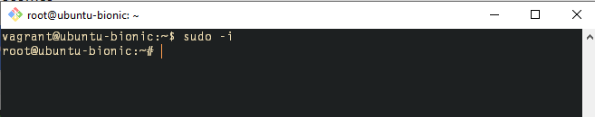
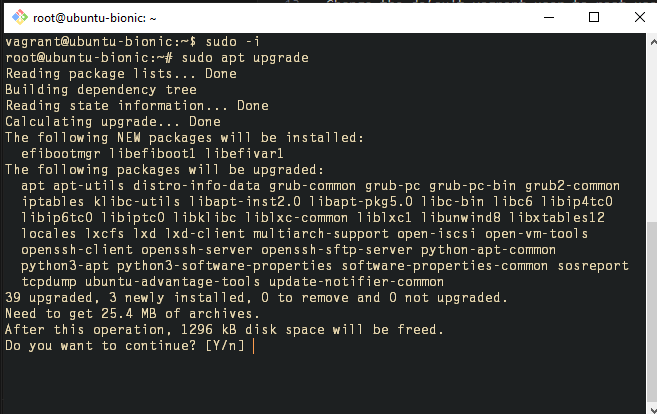
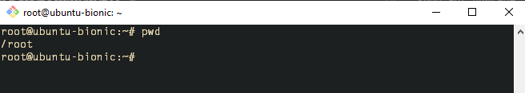

This Project is to document and demonstrate the Linux skill acquired in the journey of becoming a DevOps Engineer.
First Install a virtual box https://www.virtualbox.org/
Second, Download and install Vagrant from https://developer.hashicorp.com/vagrant/downloads
Third, download and install gitbash https://git-scm.com/downloads
Launch the gitbash and go to the directory where you have your project using cd /path/project_folder/
Download a copy of vagrant file into the project folder
 https://developer.hashicorp.com/vagrant/docsConfigure and configure it to run any version of the linux(https://app.vagrantup.com/boxes/search) you desire in my case bionic64. 
 Vagrant is the command line utility for managing the lifecycle of virtual machines.
Run vagrant up command 
After successfully launch the Linux machine, log into the linux by using vagrant ssh optional (VMname) 

Basic Linux Command
Change the default vagrant user to root user by running this command

sudo -i

sudo apt upgrade

pwd command - show the current directory you're working on

